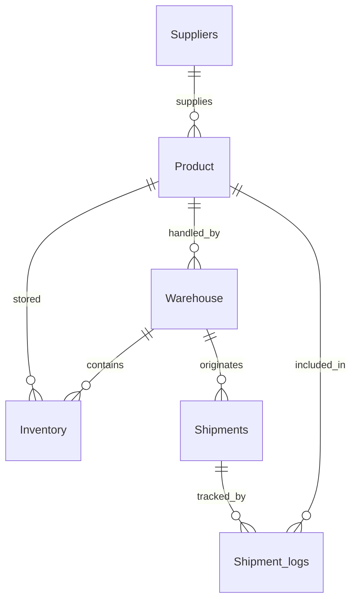

# Relational Data Model & Schema Design

## Database Schema (SQL Server Dialect)

```sql
-- CREATE DATABASE SupplyChainDB;
-- USE SupplyChainDB;

-- 1. Suppliers Table
CREATE TABLE Suppliers (
    supplier_id INT IDENTITY(1,1) PRIMARY KEY,
    contact_id INT NOT NULL,
    rating INT NOT NULL CHECK (rating >= 1 AND rating <= 5),
    contact_email VARCHAR(100) NOT NULL CHECK (contact_email LIKE '%_@__%._%')
);

-- 2. Product Table
CREATE TABLE Product (
    product_id INT IDENTITY(1,1) PRIMARY KEY,
    product_name VARCHAR(100) NOT NULL,
    unit_price DECIMAL(10,2) NOT NULL CHECK (unit_price >= 0),
    lead_time_day INT NOT NULL CHECK (lead_time_day >= 0),
    supplier_id INT NOT NULL FOREIGN KEY REFERENCES Suppliers(supplier_id) ON DELETE CASCADE
);

-- 3. Warehouse Table
CREATE TABLE Warehouse (
    warehouse_id INT IDENTITY(1,1) PRIMARY KEY,
    warehouse_name VARCHAR(100) NOT NULL,
    capacity INT NOT NULL CHECK (capacity >= 0),
    product_id INT NOT NULL FOREIGN KEY REFERENCES Product(product_id)
);

-- 4. Inventory Table (Composite Primary Key)
CREATE TABLE Inventory (
    warehouse_id INT NOT NULL,
    product_id INT NOT NULL,
    location VARCHAR(50) NOT NULL,
    quantity INT NOT NULL CHECK (quantity >= 0),
    PRIMARY KEY (warehouse_id, product_id),
    FOREIGN KEY (warehouse_id) REFERENCES Warehouse(warehouse_id) ON DELETE CASCADE,
    FOREIGN KEY (product_id) REFERENCES Product(product_id)
);

-- 5. Shipments Table
CREATE TABLE Shipments (
    shipment_id INT IDENTITY(1,1) PRIMARY KEY,
    shipment_date DATE NOT NULL,
    warehouse_id INT NOT NULL FOREIGN KEY REFERENCES Warehouse(warehouse_id) ON DELETE CASCADE,
    tracking_number VARCHAR(100) NOT NULL UNIQUE
);

-- 6. Shipment_logs Table (Composite Primary Key)
CREATE TABLE Shipment_logs (
    shipment_id INT NOT NULL,
    log_seq_num INT NOT NULL,
    log_timestamp DATETIME NOT NULL DEFAULT GETDATE(),
    event_type VARCHAR(50) NOT NULL,
    product_id INT NOT NULL FOREIGN KEY REFERENCES Product(product_id),
    PRIMARY KEY (shipment_id, log_seq_num),
    FOREIGN KEY (shipment_id) REFERENCES Shipments(shipment_id) ON DELETE CASCADE
);

-- Users Table (for Authentication & Role-Based Access)
CREATE TABLE Users (
    user_id INT IDENTITY(1,1) PRIMARY KEY,
    email VARCHAR(100) NOT NULL UNIQUE,
    password_hash VARCHAR(255) NOT NULL,
    role VARCHAR(20) NOT NULL CHECK (role IN ('Admin', 'Viewer'))
);
```

## Entity Relationships & Main Joins



### Key Join Queries to Demonstrate
1. **Suppliers → Product**:
   Show products alongside their supplier's email and rating.
   ```sql
   SELECT p.product_id, p.product_name, p.unit_price, s.contact_email, s.rating
   FROM Product p
   INNER JOIN Suppliers s ON p.supplier_id = s.supplier_id;
   ```

2. **Product → Inventory → Warehouse**:
   Get full inventory visibility of which products are stored in which warehouses.
   ```sql
   SELECT w.warehouse_name, p.product_name, i.location, i.quantity
   FROM Inventory i
   INNER JOIN Product p ON i.product_id = p.product_id
   INNER JOIN Warehouse w ON i.warehouse_id = w.warehouse_id;
   ```

3. **Shipments → Shipment_logs**:
   Retrieve the status transition timeline for all shipments.
   ```sql
   SELECT s.shipment_id, s.tracking_number, sl.log_seq_num, sl.event_type, sl.log_timestamp
   FROM Shipments s
   INNER JOIN Shipment_logs sl ON s.shipment_id = sl.shipment_id
   ORDER BY s.shipment_id, sl.log_seq_num;
   ```
